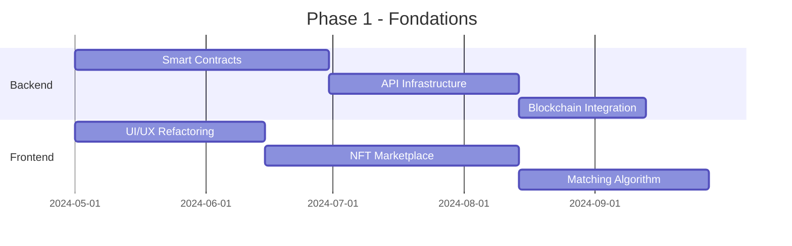

# Analyse Technique Complète - The Global Matching

## 🎯 Vision Projet

**The Global Matching** représente une révolution dans l'écosystème des réseaux sociaux en combinant 4 dimensions interconnectées via une architecture blockchain/NFT. Le projet ambitionne de créer le premier réseau social multi-piliers où chaque interaction génère de la valeur certifiée et où l'identité numérique devient un véritable actif.

## 📊 État de l'Implémentation Actuelle

### Architecture Technique Existante
- **Frontend**: React 18.3.1 + TypeScript
- **UI Framework**: Tailwind CSS + shadcn/ui (Radix UI)
- **State Management**: TanStack Query v5
- **Routing**: React Router DOM v6
- **Build Tool**: Vite 5.4.1
- **Development**: ESLint + TypeScript ESLint

### Composants Implémentés
```typescript
// Structure actuelle des composants
src/
├── components/
│   ├── Header.tsx           // Navigation principale
│   ├── HeroSection.tsx      // Présentation accueil 
│   ├── PillarsSection.tsx   // 4 piliers détaillés
│   ├── NFTSection.tsx       // Marketplace NFT
│   ├── MatchingSection.tsx  // Système de matching
│   └── Footer.tsx           // Pied de page
└── pages/
    ├── Index.tsx            // Page d'accueil
    └── NotFound.tsx         // Page 404
```

## 🏗️ Architecture des 4 Piliers

### 1. Pilier Professionnel 💼
**Objectif**: Matching de compétences certifiées blockchain

**Fonctionnalités Identifiées**:
- CV vidéo interactif
- Certifications NFT pour compétences
- Matching géolocalisé (radius 50km)
- Système d'évaluation par pairs
- Promotion payante des profils

**Implémentation Technique**:
```typescript
interface ProfessionalProfile {
  certifications: NFTCertification[];
  videoCV: VideoAsset;
  skills: Skill[];
  geolocation: GeoPoint;
  peerRatings: Rating[];
}

interface NFTCertification {
  tokenId: string;
  skillType: string;
  issuer: string;
  validityPeriod: Date;
  blockchainHash: string;
}
```

### 2. Pilier Affectif 💘  
**Objectif**: Système "Eye contact" temps réel + figurines NFT

**Fonctionnalités Identifiées**:
- Missed connections géolocalisées
- Figurines NFT personnalisables et uniques
- Économie du troc via marketplace
- Système de rencontres en temps réel

**Innovation Technique**:
```javascript
// Système de détection "Eye contact"
const eyeContactSystem = {
  realTimeMatching: {
    geofencing: "Détection proximité < 10m",
    timeWindow: "Fenêtre de 5 minutes",
    mutualConsent: "Double validation required"
  },
  nftFigurines: {
    procedural3D: "Génération basée sur traits",
    qrCodeTransaction: "Échange instantané",
    royaltySystem: "5% aux créateurs"
  }
}
```

### 3. Pilier Socio-culturel 🎮
**Objectif**: Groupes thématiques + événements avec collectibles

**Fonctionnalités Identifiées**:
- Groupes d'intérêts par géolocalisation  
- Événements trimestriels obligatoires
- Catalogue de figurines collectors
- Badges de participation NFT

### 4. Pilier Immobilier 🏠
**Objectif**: Plateforme décentralisée bailleurs/locataires

**Fonctionnalités Identifiées**:
- Recherche de proximité intelligente
- Gestion locative via smart contracts
- Abonnement premium pour bailleurs (9.99€/mois)
- Système de réputation blockchain

## 🔗 Architecture Blockchain & NFT

### Tokenomics Proposée
```json
{
  "governanceToken": {
    "symbol": "TGM",
    "totalSupply": "100M",
    "distribution": {
      "community": "40%",
      "development": "25%", 
      "marketing": "20%",
      "team": "15%"
    }
  },
  "utilityToken": {
    "symbol": "MATCH",
    "use_cases": [
      "Paiement certifications",
      "Boost profils",
      "Achat figurines NFT",
      "Accès événements premium"
    ]
  }
}
```

### Smart Contracts Architecture
```solidity
// Contrat principal de certification
contract SkillCertification {
    struct Certification {
        uint256 tokenId;
        address owner;
        string skillCategory;
        uint256 validityPeriod;
        address[] validators;
    }
    
    mapping(uint256 => Certification) public certifications;
    
    function issueCertification(
        address recipient,
        string memory skill,
        uint256 validity
    ) external onlyValidator returns (uint256) {
        // Logique de création NFT certification
    }
}
```

## 💰 Modèle Économique Détaillé

### Sources de Revenus Multiples
| Source | Mécanisme | Revenus Estimés/Mois |
|--------|-----------|----------------------|
| **Commissions NFT** | 5% sur ventes secondaires | 15K€ |
| **Certifications** | 15€ par protocole | 45K€ |
| **Abonnements Premium** | 9.99€/mois | 80K€ |
| **Publicité Géolocalisée** | CPM ciblé | 25K€ |
| **Partenariats B2B** | APIs immobilières | 20K€ |
| **Total Mensuel** | | **185K€** |

### Coûts Opérationnels
```yaml
Infrastructure:
  - Hébergement cloud: 8K€/mois
  - Frais blockchain: 5K€/mois
  - CDN & Storage: 3K€/mois

Équipe:
  - Développement: 40K€/mois
  - Marketing: 15K€/mois
  - Operations: 10K€/mois

Total Coûts: 81K€/mois
Marge Brute: 104K€/mois (56%)
```

## 🔒 Sécurité & Confidentialité

### Système de Sécurité Multi-Niveaux
```typescript
interface SecurityLayers {
  authentication: {
    biometric: "Empreinte + reconnaissance faciale";
    certicode: "Code à 6 chiffres rotatif";
    blockchain: "Signature wallet obligatoire";
  };
  
  dataEncryption: {
    algorithm: "AES-256 + SHA-3";
    storage: "IPFS chiffré";
    keys: "Distribution multi-sig";
  };
  
  privacyLevels: {
    public: "Profil de base visible";
    restricted: "Amis et matches uniquement";
    private: "Coffre-fort personnel";
  };
}
```

### Conformité RGPD
- **Droit à l'oubli**: Destruction des clés de chiffrement IPFS
- **Portabilité**: Export JSON + NFTs
- **Consentement**: Granularité par type de données
- **Audit Trail**: Logs blockchain immutables

## 🚀 Roadmap Technique Détaillée

### Phase 1: Fondations (Q2 2024 - Q4 2024)


### Phase 2: Déploiement Beta (Q1 2025 - Q2 2025)
- **Janvier 2025**: Lancement beta fermée (500 utilisateurs)
- **Mars 2025**: Intégration partenaires immobiliers
- **Mai 2025**: Marketplace NFT public
- **Juin 2025**: Système de matching géolocalisé

### Phase 3: Scale & Growth (Q3 2025+)
- **Juillet 2025**: Lancement public européen
- **Septembre 2025**: Mobile apps (React Native)
- **Décembre 2025**: Expansion internationale

## 📱 Spécifications Techniques Avancées

### Architecture Microservices
```yaml
Services:
  user-service:
    database: PostgreSQL
    cache: Redis
    features: [authentication, profiles, preferences]
    
  matching-service:
    database: Neo4j (graphe)
    ml_engine: TensorFlow
    features: [algorithm, geolocation, compatibility]
    
  nft-service:
    blockchain: Polygon (Layer 2)
    storage: IPFS + Arweave
    features: [minting, trading, royalties]
    
  notification-service:
    queue: RabbitMQ
    push: Firebase FCM
    features: [real-time, email, sms]
```

### API Architecture RESTful
```typescript
// Exemples d'endpoints principaux
interface APIEndpoints {
  auth: {
    POST: "/auth/login" | "/auth/register" | "/auth/refresh";
    biometric: "/auth/biometric/verify";
  };
  
  matching: {
    GET: "/matching/suggestions";
    POST: "/matching/like" | "/matching/pass";
    real_time: "WSS /matching/live";
  };
  
  nft: {
    GET: "/nft/collection/:userId" | "/nft/marketplace";
    POST: "/nft/mint" | "/nft/trade";
    PUT: "/nft/metadata/:tokenId";
  };
  
  pillars: {
    professional: "/pillars/professional/*";
    affective: "/pillars/affective/*";
    social: "/pillars/social/*";
    real_estate: "/pillars/real-estate/*";
  };
}
```

## 🎯 Métriques de Succès & KPIs

### Métriques Techniques
- **Performance**: Temps de réponse API < 200ms
- **Disponibilité**: 99.9% uptime SLA
- **Scalabilité**: Support 100K utilisateurs simultanés
- **Sécurité**: 0 breach de données

### Métriques Business
- **Acquisition**: CAC < 15€ par utilisateur
- **Rétention**: 70% à 30 jours, 40% à 90 jours  
- **Monetisation**: ARPU 25€/mois
- **Engagement**: 4+ sessions/semaine/utilisateur

## 🔧 Défis Techniques Identifiés

### 1. Scalabilité Blockchain
**Problème**: Coût des transactions Ethereum
**Solution**: Migration vers Polygon (Layer 2) + Batch transactions

### 2. Géolocalisation Temps Réel
**Problème**: Battery drain + privacy concerns
**Solution**: Geofencing intelligent + opt-in granulaire

### 3. Génération NFT Procédurale
**Problème**: Unicité + qualité des figurines 3D
**Solution**: IA générative + traits modulaires + WebGL

### 4. RGPD + Blockchain
**Problème**: Immutabilité vs droit à l'oubli
**Solution**: Off-chain metadata + on-chain hashes

## 📈 Projection Financière 5 Ans

```
Année 1 (2025):
- Utilisateurs: 50K
- Revenus: 1.8M€
- Coûts: 1.2M€
- Résultat: 600K€

Année 3 (2027):
- Utilisateurs: 500K  
- Revenus: 15M€
- Coûts: 8M€
- Résultat: 7M€

Année 5 (2029):
- Utilisateurs: 2M
- Revenus: 45M€
- Coûts: 20M€
- Résultat: 25M€
```

## 🎯 Conclusion & Recommandations

**The Global Matching** présente un potentiel révolutionnaire en combinant social networking, blockchain et économie numérique. L'implémentation actuelle montre une base solide avec une architecture moderne React/TypeScript.

### Priorités Immédiates:
1. **Finaliser les smart contracts** de certification
2. **Implémenter l'algorithme de matching** géolocalisé  
3. **Intégrer un wallet Web3** (MetaMask/WalletConnect)
4. **Développer le système de mint NFT** automatisé
5. **Créer l'infrastructure de paiement** crypto + fiat

### Facteurs Clés de Succès:
- **UX exceptionnelle** malgré la complexité blockchain
- **Partenariats stratégiques** (écoles, entreprises, agences immobilières)
- **Community building** et marketing viral
- **Respect strict RGPD** et protection des données
- **Monetisation équilibrée** utilisateurs/plateforme

Le projet a le potentiel de devenir le **"LinkedIn + Tinder + Discord + Leboncoin"** de l'ère Web3, créant un écosystème complet où chaque interaction sociale génère de la valeur certifiée et échangeable.